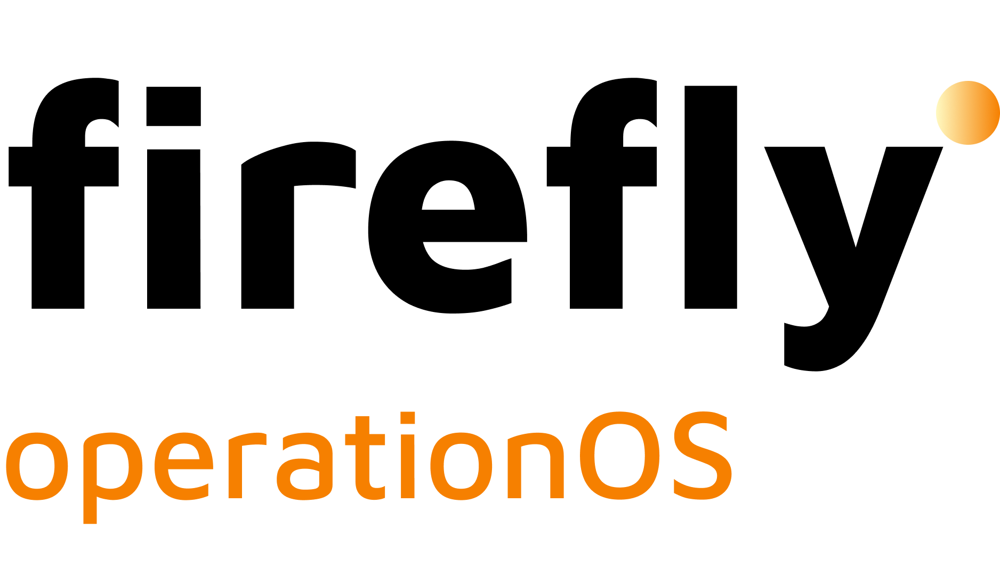

<div align="center">



### **Pure-multimodal Intelligent Document Processing**

Field extraction with bounding boxes, structured validation, LLM
cross-checking, and a business-rule engine — exposed as a production
HTTP service with both synchronous and queue-backed asynchronous APIs,
independent of any particular product or vertical.

[](https://www.python.org)
[](https://github.com/fireflyframework/fireflyframework-pyfly)
[](https://github.com/fireflyframework/fireflyframework-agentic)
[](docs/api-reference.md)
[](https://github.com/firefly-operationOS/flydocs/actions/workflows/pr-gate.yaml)
[](https://github.com/firefly-operationOS/flydocs/actions/workflows/docker-publish.yaml)
[](https://github.com/firefly-operationOS/flydocs/pkgs/container/flydocs)

</div>

---

> **In a hurry?** &nbsp;Jump to the [**5-minute Quickstart →**](QUICKSTART.md) &nbsp;·&nbsp; SDK paths: [Python](sdks/python/QUICKSTART.md) · [Java / Spring Boot](sdks/java/QUICKSTART.md) &nbsp;·&nbsp; Compose payloads: [**Payload reference →**](docs/payload-reference.md)
>
> **Coming from v0?** &nbsp;Every old key → new key is in [**docs/migration-v0-to-v1.md**](docs/migration-v0-to-v1.md), with side-by-side worked examples.

---

## Why this service exists

KYC reviews, contract intake, claims triage, invoice processing — every
operations team has the same workflow underneath:

> _"Take this document, tell me what it says, decide whether it passes
> our checks, and route it accordingly."_

Doing that with traditional OCR pipelines is brittle: layouts change,
new document types arrive every quarter, and the team ends up
hand-coding extraction rules that don't survive a single redesign.

**flydocs** collapses the whole workflow into one HTTP call. You
ship the document, declare the fields and rules you care about as
JSON, and the service returns a structured verdict — every value
tagged with a bounding box, a confidence score, a validation outcome,
an LLM judge re-check, and the resolved business rules. No layout
templates, no OCR coordinates, no model fine-tuning.

It is built to drop into a production back-office pipeline: idempotent
APIs, queue-backed async jobs with HMAC-signed webhooks, observability
out of the box, and clean failure isolation per pipeline stage.

---

## What you get back

You give the service one HTTP request. The response is a single JSON
object containing, for every document you asked about:

| Layer                          | What it tells you                                                                              |
| ------------------------------ | ---------------------------------------------------------------------------------------------- |
| **Fields**                     | The extracted value, page numbers, normalised bounding box (with a geometric quality verdict, a `source` discriminator — `llm` / `pdf_text` / `ocr` — and a `refinement_confidence`), model confidence, and free-text notes. Array and object fields nest recursively. |
| **Field validation**           | Per-field pass / fail plus the verdict of every built-in `ValidatorSpec` (IBAN, BIC, NIF/NIE/CIF, VAT, SSN, Luhn, phone (E.164), country / language / postal code, lat/lon, IPv4/IPv6, URI/URL/email/domain/slug, UUID, JSON, hex color, date / time / datetime / ISO 8601, currency code, amount, passport). Each spec carries a `severity` (`error` flips the field invalid; `warning` records the finding but keeps the field valid). |
| **Visual authenticity**        | Yes/no verdicts on caller-defined `visual_checks` (signature present, stamp present, photo present, …). |
| **Content authenticity**       | Document-level integrity audit: date consistency, totals tally, expected boilerplate, tampering signals. |
| **Judge**                      | A second LLM pass re-checks each extracted value against the document and stamps `pass` / `fail` / `uncertain` with evidence and a `flag_for_review` bit. |
| **Judge escalation**           | Optional re-run of `extract` + `judge` with a stronger `escalation.model` when the judge's first pass fails too many fields. The `pipeline.escalation` block in the response audits the trigger (`primary_fail_rate`, `escalation_fail_rate`, `accepted`). |
| **Post-extraction transforms** | Declarative entity resolution (dedupe people across documents by DNI + name variants) and free-form LLM transformations (closed-taxonomy normalisation, role mapping, …). Per-document outputs land in the affected `documents[].field_groups[]`; cross-document outputs land in `request_transformations[]`. |
| **Business rules**             | Boolean / categorical decisions over fields, validator outcomes, and other rules' results — evaluated as a DAG with `graphlib.TopologicalSorter`, batched per level into one LLM call. _"Is this KYC-complete?"_, _"Escalate to manual review?"_, _"Approve / reject"_. |
| **Multi-file summary**         | `files[]` carries one entry per input file (filename, MIME type, page count, byte size, final `matched_type`, classifier verdict). Files that don't match any declared `document_type` show up in `discovered_documents[]` instead of being dropped. |
| **Pipeline errors**            | Non-fatal per-stage failures are surfaced in `pipeline.errors[]` (one entry per failed node with `code`, `message`, `node`) — the request still returns with `status: "partial"` instead of failing the whole call. |
| **Execution trace**            | `pipeline.trace[]` lists every executed pipeline node in DAG order with `started_at`, `completed_at`, `latency_ms`, and `status` (`success` / `failed` / `skipped`) — drop-in latency breakdown for ops dashboards. |
| **Audit trail**                | Response `id` (`ext_…`), per-stage latencies, per-doc model used, structured `outbound_call` log lines for every LLM / webhook / queue call, W3C trace context (`traceparent`, `tracestate`, `X-Correlation-Id`, `X-Tenant-Id`) propagated end-to-end. |
| **Cost telemetry**             | Aggregated `pipeline.usage` block in every response: input/output tokens + estimated USD cost — sourced from `genai-prices`, which is **provider-agnostic** (Anthropic, OpenAI, Google, Mistral, …). Broken down by agent and by model. Plus a per-call `cost_usd` on every `outbound_call` log line. |
| **Prompt caching**             | Provider-aware across the full Anthropic + OpenAI + Google + Bedrock + Azure matrix. Anthropic / Bedrock-Anthropic: explicit `cache_control` on the system prompt + last user-message block (5-minute or 1-hour TTL). OpenAI / Azure-OpenAI: automatic caching for prompts ≥1024 tokens + a stable `prompt_cache_key` routing hint so concurrent requests from the same agent share cache-backend affinity. Google Gemini: caller-supplied `CachedContent` resource ids wired through to pydantic-ai. Cache writes / reads surface as `cache_creation_tokens` / `cache_read_tokens` on the response. Toggle the whole middleware with `FLYDOCS_PROMPT_CACHE=off`. |

A single request always carries a non-empty `files[]` list — a
single file is just a one-element list. Submit several entries to ship
a multi-file pack at once: pin each file's `expected_type` when you
know it, or let the LLM classifier decide. Each extracted document
carries a `source_file` field so callers can map output back to the
input file that produced it. The full multi-file shape is documented
in [docs/api-reference.md § 2c](docs/api-reference.md#2c-multi-file--sub-document-discovery).

The same call works **synchronously** (`POST /api/v1/extract`, blocks
until done) or as an **async submission** with a webhook
(`POST /api/v1/extractions`, returns 202 + an `ext_…` id). Multi-file
submission is supported on both surfaces. Both endpoints accept
`application/json` or `multipart/form-data`.

---

## Quickstart

> **Want the 5-minute curl tour instead?** &nbsp;See [`QUICKSTART.md`](QUICKSTART.md)
> — `task docker:up:test` + one curl call against a mock LLM, no API keys.
> The section below is the **full** walk-through (real provider keys,
> Postgres, worker, multi-file async job + transformation).

A complete walk-through from a fresh clone to your first **sync**
extraction and your first **async, multi-file** job with a
transformation. Pick whichever provider you have a key for —
`fireflyframework-genai` resolves the right credential from the model
id prefix.

### 0. Prerequisites

- **Python 3.13** (`uv` will install it on demand; otherwise install
  via `pyenv` / `asdf` / the system package manager).
- **`uv`** — the package manager (`brew install uv` on macOS, or
  `curl -LsSf https://astral.sh/uv/install.sh | sh`).
- **Docker** — for Postgres in dev, and optionally for the full stack.
- **`task`** — task runner used by every helper command
  (`brew install go-task/tap/go-task`, or see
  [taskfile.dev](https://taskfile.dev/installation/)).
- **An LLM provider key** — `ANTHROPIC_API_KEY`, `OPENAI_API_KEY`,
  `GOOGLE_API_KEY`, `MISTRAL_API_KEY`, … any one the provider you
  pick supports.

### 1. Clone and install

```bash
git clone https://github.com/firefly-operationOS/flydocs.git
cd flydocs
task deps:install        # uv sync --extra dev: pins the venv at .venv/
```

### 2. Configure the environment

```bash
task env:init            # copies env_template -> .env (gitignored)
```

Edit `.env`. The two knobs you actually need to think about:

```env
# Pick any provider + model id that fireflyframework-genai can resolve.
FLYDOCS_MODEL=anthropic:claude-sonnet-4-6
# Optional second provider used on transient errors. Mix providers freely.
FLYDOCS_FALLBACK_MODEL=openai:gpt-4o

# Set the credential matching the prefix you chose above. Set the
# fallback's credential too if it's a different provider.
ANTHROPIC_API_KEY=sk-ant-...
# OPENAI_API_KEY=sk-...
# GOOGLE_API_KEY=...
# MISTRAL_API_KEY=...
```

Everything else (Postgres URL, EDA adapter, timeouts, webhook secret,
…) has sane defaults in `env_template`.

### 3. Bring up Postgres and run migrations

```bash
task dev:db              # docker compose up Postgres (and Redis if you switch adapter)
task dev:migrate         # alembic upgrade head — creates extractions +
                         # the pyfly_eda_outbox / pyfly_eda_offsets tables
```

### 4. Start the API and the worker

Two terminals — the API serves HTTP, the worker drains the EDA bus.

```bash
# Terminal A
task dev:serve           # uvicorn on http://localhost:8400
                         # OpenAPI:    /docs
                         # Health:     /actuator/health/readiness
                         # PyFly admin: /admin

# Terminal B
task dev:worker          # subscribes via fireflyframework-pyfly's EventPublisher
```

A healthy boot prints both the `database_health` and `eda_health`
indicators as `UP`. Hit `/actuator/health/readiness` to confirm before
sending traffic.

### 5. Your first synchronous extraction

```bash
curl -s http://localhost:8400/api/v1/extract \
  -H 'content-type: application/json' \
  -d @docs/examples/extract.json | jq '.documents[0].field_groups'
```

The endpoint blocks until the pipeline finishes (or hits
`FLYDOCS_SYNC_TIMEOUT_S`, default 60 s). The response carries every
extracted field with its bounding box, validation outcome, judge
verdict, business-rule decisions, and a `pipeline.usage` block with
the USD cost. See [docs/api-reference.md](docs/api-reference.md) for
the full shape.

### 6. Your first async, multi-file extraction with a transformation

Build a payload with two files, a deduper, and a webhook callback,
then POST it. The submit returns immediately with a `202` + an
`ext_…` id; the worker drives the same pipeline and posts the result
to your `callback_url` when it finishes:

```bash
curl -s http://localhost:8400/api/v1/extractions \
  -H 'content-type: application/json' \
  -H 'idempotency-key: '"$(uuidgen)" \
  -d '{
    "intention": "KYB pack: deed + DNI. Dedupe people across docs.",
    "files": [
      {"filename": "deed.pdf", "content_base64": "JVBERi0xLjQK...",  "content_type": "application/pdf"},
      {"filename": "dni.jpg",  "content_base64": "/9j/4AAQ...",       "content_type": "image/jpeg"}
    ],
    "document_types": [ /* one DocumentTypeSpec per id — see docs/api-reference.md § 5 */ ],
    "rules": [],
    "options": {
      "stages": {"classifier": true, "judge": true, "transform": true},
      "transformations": [
        {"type": "entity_resolution", "target_group": "personas",
         "match_by": ["dni", "nombre"], "scope": "request"}
      ]
    },
    "callback_url": "https://your-workflow.example.com/idp/webhook",
    "metadata": {"tenant_id": "acme"}
  }'
```

Poll state if you don't want to wait for the webhook:

```bash
EXT_ID=ext_01HEM2ZZ7M0Q8...
curl -s http://localhost:8400/api/v1/extractions/$EXT_ID
curl -s http://localhost:8400/api/v1/extractions/$EXT_ID/result | jq
```

The webhook payload is the unified `EventEnvelope` (`event_id`,
`event_type: "extraction.completed"`, `occurred_at`, `correlation_id`,
`extraction` snapshot, …) and carries the full `ExtractionResult`
under `result` when `extraction.status == "succeeded"`. Signed with
HMAC-SHA256 in `X-Flydocs-Signature` using `FLYDOCS_WEBHOOK_HMAC_SECRET`.

### 7. (Optional) Skip steps 3–4 with the full container stack

```bash
task docker:up           # api + worker + Postgres on Docker (and Redis if adapter=redis)
task health              # GET /actuator/health
task docker:logs         # tail every container
```

This is the closest thing to production locally; the only difference
is no TLS termination in front of the service.

### 8. Run the test suite

```bash
task test                # unit suite — ~250 tests, in-memory SQLite + EDA, <2 s
task test:llm            # real-LLM smoke test — needs the provider key from step 2
```

`task lint:check` runs `ruff` + `pyright` (both gated in CI).

---

## How the request flows

The service runs the request as a DAG inside the
`fireflyframework-agentic` `PipelineEngine`. Stages are toggled per
request through `ExtractionOptions.stages`; the engine builds a fresh
DAG for each call so the audit trail reflects exactly what executed.

```
                ┌──────────────────────────────────────────────────────────────────┐
   POST  ──────▶│ load → discover? → classify? → plan_tasks → extract →            │──────▶ JSON
 (PDF/PNG/…)    │ bbox_validation → bbox_refine? → field_validation? →             │  (fields + bbox
                │ visual_auth? → content_auth? → judge? → judge_escalation? →      │   + verdicts)
                │ transform? → rules? → assemble                                   │
                └──────────────────────────────────────────────────────────────────┘
                              │
                              │  per-segment concurrency (asyncio.gather)
                              │  per-stage timeouts + error capture
                              ▼
                       structured trace
                       (id, pipeline.latency_ms, pipeline.errors)
```

The extractor and the geometric bbox check are the only mandatory
stages. Everything else is a caller-chosen trade-off between cost,
latency, and rigor. With `splitter` enabled, every file -- even a
single uploaded PDF -- is split into its sub-documents and each is
independently classified against the declared `document_types[]`, so
a pack that bundles a deed + an ID + a utility bill comes out as
three separate routed documents without the caller having to know
what's inside.

The `bbox_refine` stage grounds the LLM's bounding boxes against the
document's real text. PDF text layers go through PyMuPDF (sub-pixel
accurate); image-PDFs and rasters route to a pluggable `OcrEngine`.
Pick `tesseract` (default), `docling` (layout-aware, surfaces
table-cell + reading-order metadata -- see
[docs/docling.md](docs/docling.md)), or `none`. The extractor can also
splice a Markdown text-anchor (`FLYDOCS_EXTRACTION_TEXT_ANCHOR=docling`)
into the user prompt for the LLM to cross-reference -- useful for
multilingual scans and dense tabular documents.

See [docs/pipeline.md](docs/pipeline.md) for the deep dive.

---

## Built on the Firefly Framework

Every cross-cutting concern is delegated to the framework so the
business logic stays small.

| Concern                          | Provided by                                            |
| -------------------------------- | ------------------------------------------------------ |
| Dependency injection             | `fireflyframework-pyfly` `@configuration` + `@bean`    |
| CQRS (commands / queries / bus)  | `fireflyframework-pyfly` `@command_handler` / `@query_handler` |
| REST surface                     | `fireflyframework-pyfly` `@rest_controller` over FastAPI |
| Async pipeline DAG               | `fireflyframework-agentic` `PipelineEngine` / `PipelineBuilder` |
| Prompt management                | `fireflyframework-agentic` `PromptTemplate` + `PromptRegistry` (YAML-backed) |
| LLM agents (multimodal)          | `fireflyframework-agentic` `FireflyAgent` over `pydantic-ai` |
| EDA / async jobs                 | `fireflyframework-pyfly` `EventPublisher` — default `postgres` (durable outbox + LISTEN/NOTIFY); flip `FLYDOCS_EDA_ADAPTER` to `memory` / `redis` / `kafka` |
| W3C trace context                | `fireflyframework-pyfly` `CorrelationFilter` (default web filter) + `pyfly.observability.correlation` |
| K8s probes                       | `/actuator/health/liveness` + `/actuator/health/readiness` with `database_health` + `eda_health` indicators |
| Multi-arch container             | `ghcr.io/firefly-operationos/flydocs:latest` — linux/amd64 + linux/arm64 manifest |
| Observability                    | structlog JSON, OTLP tracing, Prometheus metrics, actuator |
| Persistence                      | SQLAlchemy async, Alembic, Postgres (SQLite for tests)  |
| RFC 7807 error responses         | `@controller_advice` exception handler                  |

Everything is wired through `fireflyframework-pyfly`'s container —
including the prompt catalog, the EDA event publisher, the webhook
publisher, and the async worker — so the application has **no
manually-constructed singletons** outside the DI graph.

---

## Project layout

```
src/flydocs/
├── interfaces/              Public DTOs + enums — the stable HTTP contract
├── models/                  SQLAlchemy entities + async repositories
├── core/
│   ├── configuration.py     @configuration with every @bean
│   └── services/
│       ├── extract/         CQRS: sync extract command + handler
│       ├── extractions/     CQRS: submit / get / list / cancel async extraction
│       ├── extraction/      MultimodalExtractor + PromptCatalog
│       ├── splitting/       LLM document splitter
│       ├── validation/      Pure-Python FieldValidator + built-in validators
│       ├── authenticity/    Visual + content audits
│       ├── judge/           LLM judge / re-evaluator
│       ├── rules/           DAG-based business rule engine
│       ├── pipeline/        PipelineOrchestrator (fireflyframework-agentic PipelineEngine)
│       ├── webhook/         Outbound webhook publisher with HMAC
│       └── workers/         ExtractionWorker (subscribes to fireflyframework-pyfly EDA)
├── resources/
│   └── prompts/             YAML prompt templates (one per LLM stage)
└── web/
    ├── controllers/         @rest_controller beans
    └── advice/              @controller_advice exception mapping
```

---

## Public API at a glance

| Endpoint                                     | Purpose                                                |
| -------------------------------------------- | ------------------------------------------------------ |
| **Sync extraction**                          |                                                        |
| `POST   /api/v1/extract`                     | Synchronous extraction. Blocks until the pipeline finishes. |
| `POST   /api/v1/extract:validate`            | Dry-run the semantic validator on a payload (no LLM call, no DB write). |
| **Async extractions**                        |                                                        |
| `POST   /api/v1/extractions`                 | Submit a queued extraction. Returns `202` + an `ext_…` id. |
| `GET    /api/v1/extractions`                 | Filtered, paginated listing (`status`, `post_processing_status`, `idempotency_key`, `created_after` / `before`, `limit`, `offset`). |
| `GET    /api/v1/extractions/{id}`            | Current state of an `Extraction` (incl. post-processing block). |
| `GET    /api/v1/extractions/{id}/result`     | Final `ExtractionResult`. Long-poll for grounded bboxes via `?wait_for_bboxes=true&timeout=…`. |
| `DELETE /api/v1/extractions/{id}`            | Cancel an extraction that is still `queued`.           |
| **Service metadata**                         |                                                        |
| `GET    /api/v1/version`                     | Build + model + EDA-adapter info.                      |
| `GET    /openapi.json`                       | Machine-readable OpenAPI 3.1 spec.                     |
| `GET    /docs`                               | Swagger UI (OpenAPI 3.1).                              |
| `GET    /admin`                              | PyFly Admin dashboard — beans, mappings, env, CQRS, traces, loggers, health. |
| **Actuator (ops)**                           |                                                        |
| `GET    /actuator/health`                    | Composite health (DB + EDA).                           |
| `GET    /actuator/health/liveness`           | Kubernetes liveness probe.                             |
| `GET    /actuator/health/readiness`          | Kubernetes readiness probe — `503` when `database_health` or `eda_health` is `DOWN`. |
| `GET    /actuator/metrics`                   | Prometheus metrics.                                    |

Full request / response shapes in [docs/api-reference.md](docs/api-reference.md). Errors follow RFC 7807 (`application/problem+json`) — see the [error-code catalogue](docs/api-reference.md#8-error-codes).

---

## What's bundled

**Standard validators** — pure-Python checkers you can declare per
field. They run after extraction and never call the LLM:

| Group        | Validators                                                                       |
| ------------ | -------------------------------------------------------------------------------- |
| Network      | `email`, `uri`, `url`, `domain`, `slug`, `ipv4`, `ipv6`                          |
| Temporal     | `date`, `datetime`, `time`, `iso_8601`                                           |
| Identifiers  | `uuid`, `json`, `hex_color`                                                      |
| Finance      | `iban` (mod-97), `bic`, `credit_card` (Luhn), `currency_code`, `amount`          |
| Telephony    | `phone_e164`                                                                     |
| Geographic   | `country_code`, `language_code`, `postal_code` (country-aware), `latitude`, `longitude` |
| National IDs | `nif` (ES, mod-23), `nie`, `cif`, `vat_id`, `ssn`, `passport_number`             |

Each one accepts optional `params` (e.g. `{"country": "ES"}`) and a
`severity` (`error` flips the field invalid; `warning` records the
finding but keeps the field valid). See
[docs/validators.md](docs/validators.md).

**Prompt catalog** — every LLM stage reads its system + user prompt
from a YAML file under `src/flydocs/resources/prompts/`. The
catalog is a normal `fireflyframework-pyfly` bean; you can swap templates, bump versions,
or A/B-test prompts without touching Python. See
[docs/prompts.md](docs/prompts.md).

**Business rule engine** — declare predicates that depend on fields,
validator outcomes, or other rules. Rules form a DAG; the engine
evaluates them level-by-level via `graphlib.TopologicalSorter` and
groups same-level rules into a single LLM call to amortise cost.
Cycles are rejected before any LLM call is issued. See
[docs/rule-engine.md](docs/rule-engine.md).

```jsonc
{
  "id": "kyc_complete",
  "predicate": "All identity fields are populated AND nif is valid.",
  "parents": [
    {"kind": "field", "document_type": "passport",
     "fields": ["full_name", "nif"]}
  ],
  "output": {"type": "boolean", "valid_outputs": ["true", "false"]}
}
```

---

## Documentation map

| Document                                       | Read it when…                                                            |
| ---------------------------------------------- | ------------------------------------------------------------------------ |
| [QUICKSTART.md](QUICKSTART.md)                 | You want your first extraction in five minutes (HTTP / curl).            |
| [docs/payload-reference.md](docs/payload-reference.md) | You're composing the request payload — every field, option, variant, and worked example. |
| [docs/overview.md](docs/overview.md)           | You're new and want a guided tour of the system.                         |
| [docs/architecture.md](docs/architecture.md)   | You need to know how `fireflyframework-pyfly` + `fireflyframework-agentic` plug together. |
| [docs/pipeline.md](docs/pipeline.md)           | You're touching the orchestrator or adding a new stage.                  |
| [docs/api-reference.md](docs/api-reference.md) | You're integrating with the HTTP API.                                    |
| [docs/transformations.md](docs/transformations.md) | You want to dedupe, normalise or run free-form LLM transformations on extracted data. |
| [docs/validators.md](docs/validators.md)       | You want to know what validators are built-in.                           |
| [docs/rule-engine.md](docs/rule-engine.md)     | You're designing business rules.                                         |
| [docs/prompts.md](docs/prompts.md)             | You're editing or adding YAML prompt templates.                          |
| [docs/deployment.md](docs/deployment.md)       | You're shipping the service to a real environment.                       |
| [docs/troubleshooting.md](docs/troubleshooting.md) | A real-world problem just blew up.                                   |
| [docs/migration-v0-to-v1.md](docs/migration-v0-to-v1.md) | You're migrating a v0 integration to v1.                          |

---

## Operations & developer workflows

```bash
task deps:install        # uv sync --extra dev
task lint:check          # ruff + pyright
task test                # unit suite (~26 tests, <1s)
task test:llm            # real-LLM smoke test (needs the provider key matching FLYDOCS_MODEL)
task dev:serve           # API on :8400
task dev:worker          # async job consumer
task migrate             # alembic upgrade head
task docker:build        # build the production image
task docker:up           # full stack — api + worker + Postgres + Redis
task docker:up:test      # stack with mock-llm for integration tests
task health              # GET /actuator/health
task version             # GET /api/v1/version
task openapi             # dump the OpenAPI spec
```

Full task surface is in [Taskfile.yml](Taskfile.yml).

---

<div align="center">

**flydocs** is part of [Firefly OperationOS](https://github.com/firefly-operationOS) — the
open back-office plane. flydocs itself is product- and vertical-agnostic:
plug it into any platform that needs to turn documents into structured,
verifiable data.

Official SDKs: [Python](sdks/python/) (`flydocs-sdk` — wheel on GitHub
Releases, install with `uv add <release-url>`) · [Java / Spring
Boot](sdks/java/) (`com.firefly.flydocs:flydocs-sdk` on GitHub
Packages). See [sdks/README.md](sdks/) for install + quickstart.

Copyright © 2026 Firefly Software Solutions Inc

</div>
